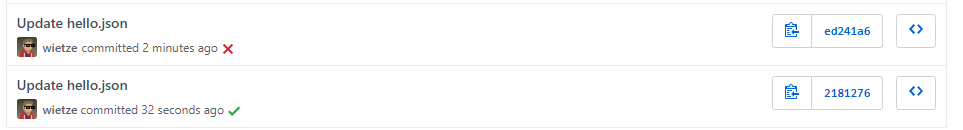
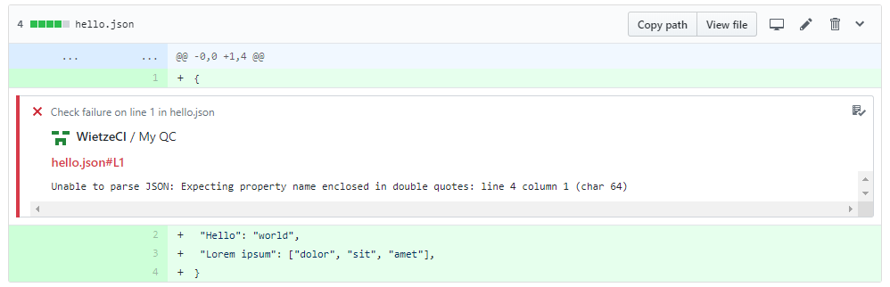

# github-checks-api
[GitHub Checks](https://developer.github.com/v3/checks/) allows you to quickly see the results of your CI tests from GitHub.


This is a simple, light-weight python implementation of the GitHub Checks API.

# Examples
Once you have completed all the installation steps, here are a few examples of what your Checks implementation could look like:

Automatically run Checks for new commits:


Annotate files with messages explaining why they failed tests:


# Installation

Note that you need a self-hosted server that will run your CI logic. 

## 1: Creating a new GitHub app
In GitHub, do the following:
1. Click your profile in the right top corner, click _Settings_, click _Developers Settings_, click _GitHub Apps_ and click _New GitHub App_.
2. Add a name and homepage URL (any URL will do). For _User authorization callback URL_ and _Webhook URL_, use the server address you'll be using, with `/hook` at the end of the address.
3. Generate a strong, random secret and set it as _Webhook secret (optional)_. While optional in GitHub, this project won't work without one.
4. Under _Permissions_, set the following: 

   |Name|Permission| 
   |----|----------| 
   |**Checks**|Read & write| 
   |**Repository contents**|Read| 
   |**Repository metadata**|Read|

5. Under _Subscribe to events_, tick _Check runs_.
6. Click _Create GitHub App_.
7. If the creation was successful, you'll see an overview of your app. Copy the **App ID** as you'll need it for setting up the script.
8. Scroll to the bottom of the page to generate a private key. Save the file as `pk.pem`, as you'll need it for setting up the script.

## 2: Setting up the server

The server will run on port 443, using a simple Python 3 Flask server.

1. Install all dependencies by running the following command:
   ```bash
   pip install -r requirements.txt
   ```

2. To create a locally signed SSL certificate, run the followingin the same folder as `server.py`:
   ```bash
   openssl req -x509 -newkey rsa:4096 -nodes -out cert.pem -keyout key.pem -days 365
   ```

3. Copy `pk.pem` (see 'Creating a GitHub app' section) to the same folder as `server.py`.
4. Update `example.py` to set the correct **App ID**. If you're using GitHub Enterprise, also update the `base_api` parameter.

## 3: Running the server

Run the server as follows:

```
GITHUB_WEBHOOK_SECRET={{your_secret_here}} sudo -E python3 server.py
```

Make sure you replace `{{your_secret_here}}` with your webhook secret set in GitHub (see 'Creating a GitHub app' section). You might want to consider changing port 443 to something else so that `server.py` doesn't have to run using sudo.
